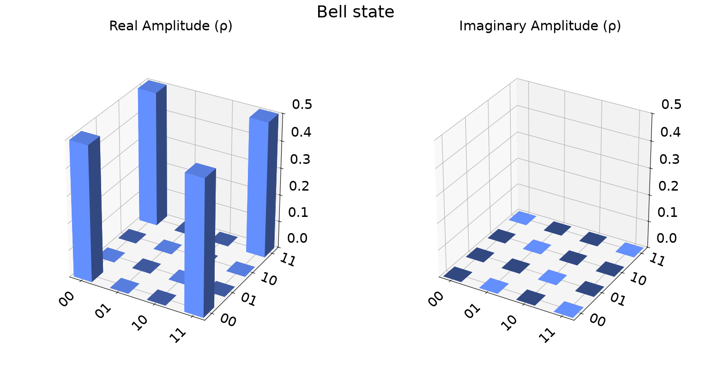

# Foundations and quantum information

A qubit is described by complex amplitudes, while measurement produces an ordinary classical outcome. The state `|ψ⟩ = α|0⟩ + β|1⟩`, its normalization, unitary transformations, and measurement probabilities provide the mathematical starting point. Tensor products then extend this description to multiple qubits, where controlled gates can create entanglement.

[Hello, quantum world!](hello-quantum-world.ipynb) introduces circuits, simulators, statevectors, and measurement. [BB84](bb84.ipynb) connects incompatible measurement bases to quantum key distribution. [Entanglement](entanglement.ipynb) prepares the Bell state `|Φ⁺⟩`, while [CHSH](chsh.ipynb) tests correlations that exceed the classical limit. [Teleportation and superdense coding](teleportation-superdense-coding.ipynb) studies how a shared Bell pair changes the resources needed for communication.

## Conceptual interpretation

The Bell-state density matrix contains nonzero diagonal terms for `|00⟩` and `|11⟩`, together with off-diagonal coherence terms connecting them. Those coherence terms distinguish an entangled superposition from a classical fifty-fifty mixture.

*The real part contains four terms of magnitude 0.5, while the imaginary part is zero for this Bell state.*

The saved BB84 run retains 61 bits from 100 prepared bits after Alice and Bob compare their bases. This is one random result; the expected retained fraction approaches one half over many runs. The notebook demonstrates preparation, measurement, and key sifting, but it does not implement eavesdropper detection or prove protocol security.

The saved CHSH simulation produces a winning probability of about 0.856. This exceeds the classical maximum of 0.75 and is close to the ideal quantum value. Because the saved result comes from local simulation, it verifies the circuit logic rather than the behavior of physical hardware.

The superdense-coding experiment sends the classical message `10` and recovers `10`, showing how one transmitted qubit and a previously shared Bell pair can communicate two classical bits. The teleportation section is present, but it has no saved execution and one execution block is currently stored as Markdown, so it should be treated as incomplete until repaired and rerun.

## Implementation status

The completed sections use the modern Qiskit API and run locally. Optional hardware sections remain disabled. The simulator comparison figure is not included here because three labels in its current legend are ordered incorrectly. The modernization approach is explained in [About the notebooks](../README.md).
