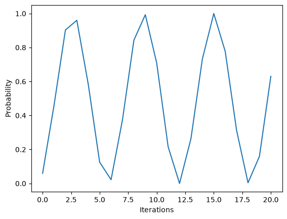
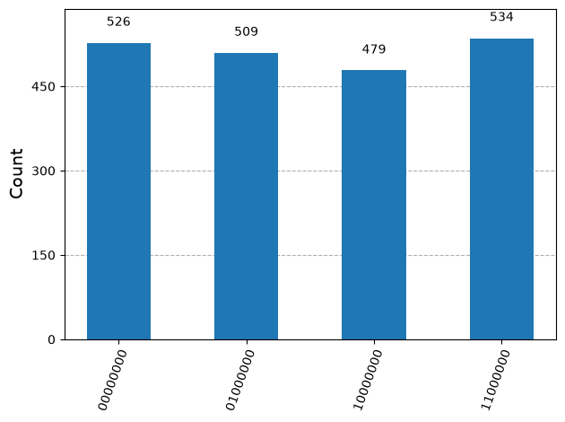

# Quantum algorithms

Quantum algorithms use interference to increase the probability of useful answers and suppress unwanted ones. Reversible oracles encode a problem without directly revealing its solution, while phase kickback, amplitude amplification, and the quantum Fourier transform turn hidden structure into measurable information.

[Deutsch–Jozsa](deutsch-jozsa.ipynb) distinguishes constant and balanced functions. [Grover’s algorithm](grover.ipynb) amplifies a marked state through repeated oracle and diffusion operations. [Oracle-search examples](oracle-search-examples.ipynb) implements Boolean-expression oracles with current Qiskit components. [Shor order finding](shor-order-finding.ipynb) combines modular arithmetic, phase estimation, and classical post-processing to factor a small integer.

## Conceptual interpretation

In the ideal Deutsch–Jozsa experiment, the constant oracle produces `0000`, while the balanced oracle produces a nonzero result. The algorithm succeeds because interference combines information about every oracle evaluation into a global property of the function.

Grover’s algorithm behaves like a rotation toward the marked state. The probability rises toward one and then falls again when too many iterations are applied, so more iterations do not always improve the answer.

*The repeated peaks show amplitude amplification followed by over-rotation away from the marked state.*

The Shor example factors `N = 15` with base `a = 2`. Its measurements concentrate around four phase values, from which the classical post-processing recovers order `r = 4` and factors 3 and 5.

*The four populated outcomes reflect the periodic structure associated with order four.*

These examples show different uses of interference: Deutsch–Jozsa detects a global promise, Grover amplifies a solution, and Shor extracts a period. Quantum counting and HHL belong to the same broader progression, but they do not have separate modernized notebooks in this repository.

## Implementation status

The notebooks contain executed simulator examples using the current Qiskit API. Shor’s implementation uses small dense operators and demonstrates the logic only for toy values; it does not establish scalable factorization. The saved experiments verify expected behavior under their chosen conditions and do not demonstrate quantum advantage. The modernization approach is explained in [About the notebooks](../README.md).
