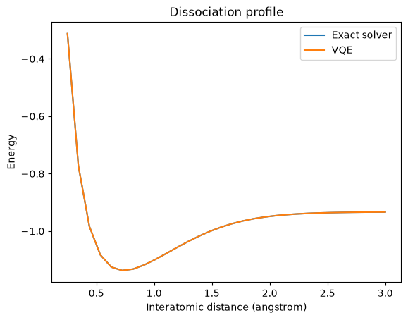

# Optimization and variational methods

Many computational problems can be written as the search for a configuration with minimum cost or energy. Binary variables can be mapped to Ising spins, Ising terms can be represented by qubit operators, and the resulting Hamiltonian becomes the object minimized by annealing or a variational quantum algorithm.

[MaxCut](MaxCut.ipynb) compares exact solution, classical simulated annealing, and an optional D-Wave execution. [QAOA](qaoa.ipynb) minimizes the Hamiltonian of a five-node cycle using parameterized circuits and a classical optimizer. [Molecular VQE](vqe-molecular-energy.ipynb) applies the variational principle to the electronic Hamiltonian of hydrogen.

## Conceptual interpretation

In MaxCut, a binary assignment determines which vertices belong to opposite sides of a partition. Each edge contributes to an objective function, and minimizing the equivalent Ising energy identifies a good cut. The notebook contains the implementation, but it has no saved execution output, so no MaxCut result is presented here.

QAOA alternates between a cost Hamiltonian and a mixing Hamiltonian. A classical optimizer changes the circuit angles to lower the measured expectation value. For the five-node cycle, the exact optimum is `−3`. The saved ideal averages improve from approximately `−2.566` at depth one to `−2.748` at depth two. The noisy depth-one run gives approximately `−0.591`, showing how hardware noise can dominate the expected improvement. These are numerical outputs; the notebook does not currently contain a QAOA plot to export.

VQE applies the same hybrid principle to a physical Hamiltonian. The parameterized quantum circuit prepares trial molecular states, while the classical optimizer searches for the state with the lowest measured energy.

*The VQE and exact curves nearly overlap across the tested bond distances, including the energy minimum near the equilibrium geometry.*

The agreement demonstrates that the chosen ansatz and optimizer reproduce this small simulated problem. It does not show that VQE is more efficient than the exact solver, particularly because the molecule is small enough to solve classically.

## Implementation status

The QAOA and VQE notebooks contain saved local results. MaxCut contains code without saved execution output, and its D-Wave section requires an external account. The molecular interpretation is developed further in [applications](../../docs/applications.md), while the notebook modernization approach is explained in [About the notebooks](../README.md).
