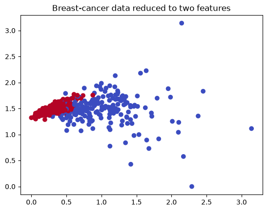
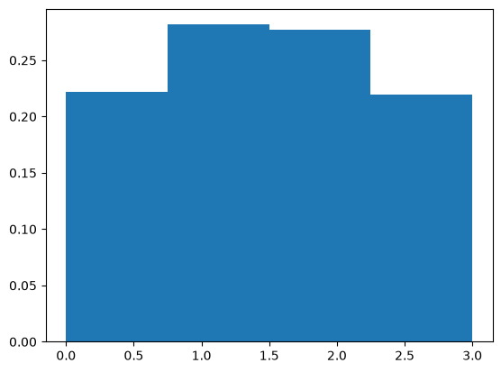
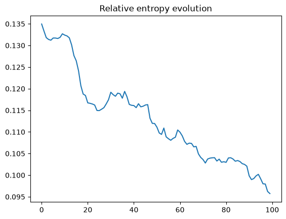

# Quantum machine learning

Quantum machine learning connects classical data to quantum circuits. A feature map encodes an input as a quantum state, a quantum kernel compares encoded states, and a variational classifier trains circuit parameters to produce useful predictions. A quantum generative model instead learns a probability distribution.

[Quantum kernels](quantum-kernels.ipynb) combines a quantum feature map with a support-vector classifier. [Variational classification](variational-classifier.ipynb) trains a parameterized circuit with a classical optimizer. [The quantum generative model](quantum-generative-model.ipynb) trains a finite-shot Qiskit generator against a classical PyTorch discriminator.

## Conceptual interpretation

A quantum kernel measures similarity through the overlap between feature-map states. The classical SVM uses this quantum-computed similarity in place of an ordinary classical kernel. A variational classifier uses the same data encoding but adds trainable gates, turning measured circuit outputs into class predictions.

*This is a view of the input data after dimensionality reduction. It shows class overlap, but it is not a decision boundary, confusion matrix, or performance result.*

The saved classifier scores range from 0.90 to 1.00 in the selected examples. However, the breast-cancer notebooks fit PCA and scaling before dividing the data into training and test sets. Information from the test set therefore affects preprocessing, so these scores should remain illustrative until preprocessing is fitted on the training data alone.

In the generative experiment, a two-qubit parameterized circuit learns probabilities over four possible values. Training uses samples from 100 circuit shots at a time, while a separate shot-free evaluation calculates the distribution and relative entropy. A classical discriminator supplies the signal used to update the generator parameters.

*The generator assigns about 0.28 probability to each central value and about 0.22 to each outer value. It learns the correct ordering, but its result remains flatter than the binomial training distribution.*

The generator and discriminator losses fluctuate around their adversarial balance, partly because training uses finite-shot estimates. Relative entropy gives a more direct comparison with the target distribution. It decreases from about 0.135 to 0.096 over 100 epochs, with small reversals during training.

*The downward trend shows measurable learning, while the nonzero final value and the flat generated histogram show that the target distribution has not been reproduced completely.*

## Implementation status

All three notebooks use current Qiskit Machine Learning components and contain saved local outputs. The replacement generative notebook also records its Qiskit, Qiskit Machine Learning, and PyTorch versions. Its small distribution, local simulation, and partial fit make it a demonstration of hybrid adversarial training rather than evidence of quantum advantage. The high-energy-physics uses of classification and generative modelling are discussed in [applications](../../docs/applications.md), and the modernization approach is explained in [About the notebooks](../README.md).
