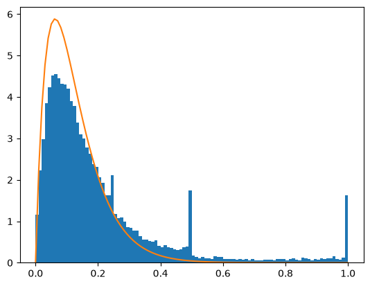

# Simulation and quantum advantage

The difficulty of classically simulating a quantum circuit depends on its structure as well as its qubit count. Some highly entangled circuits remain easy to simulate, while other circuit families produce probability distributions that become difficult to reproduce as the system grows.

[Stabilizer simulation](stabilizer-simulation.ipynb) prepares a 1,000-qubit GHZ-type state using Clifford operations. [Random-circuit sampling](random-circuit-sampling.ipynb) generates 10,000 four-qubit circuits, samples one output from each circuit, and calculates the exact probability of every sampled bit string.

## Conceptual interpretation

The stabilizer result contains only the all-zero and all-one strings, with saved counts of 510 and 514. This is the expected GHZ-type correlation. Despite using 1,000 entangled qubits, the circuit is efficiently simulable because it remains inside the Clifford stabilizer formalism. Entanglement alone is therefore insufficient to establish classical hardness.

Random-circuit sampling studies a different regime. Each random circuit creates an irregular distribution over bit strings. The notebook samples a string and records its exact output probability, producing a probability-weighted distribution rather than choosing bit strings uniformly.

*The blue histogram contains the sampled output probabilities. The orange curve is the theoretical probability-weighted Porter–Thomas reference used by the notebook.*

The general shape follows the theoretical reference, although the small four-qubit experiment also contains visible finite-size structure. This result explains the statistical idea behind random-circuit sampling, but it does not reproduce a large hardware experiment or establish quantum advantage.

The contrast between the two notebooks is the main lesson. A large stabilizer circuit can be classically manageable because of its restricted algebraic structure, while less structured random circuits can become difficult even when their purpose is only to sample outputs.

## Implementation status

Both notebooks contain saved local results using current Qiskit simulators. Boson sampling, large random-circuit experiments, classical verification methods, and hardware roadmaps remain conceptual material. Their place in the wider progression is described in the [course overview](../../docs/overview.md).
